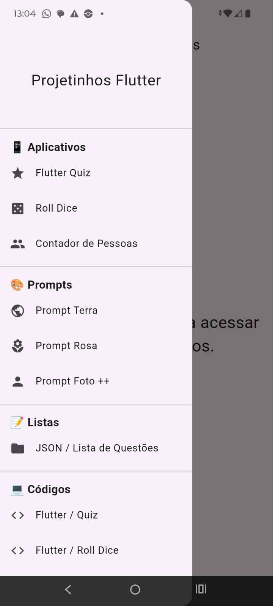

# 📱 AppMãe - Projeto Integrador

**Aplicativo principal** que centraliza todos os meus projetos desenvolvidos durante a formação em Desenvolvimento de Software.

---

## 🎯 Sobre o Projeto

Este repositório é o **guarda-chuva** dos meus projetos. Nele estou integrando vários aplicativos menores em um único app, demonstrando:

* Arquitetura escalável
* Boas práticas de desenvolvimento mobile
* Integração entre módulos
* Evolução contínua durante a formação

---

## 📸 Screenshot

  

---

## ✨ Funcionalidades Atuais

* Módulos integrados de pequenos apps
* Sistema de navegação centralizado
* Assets e recursos compartilhados
* Estrutura modular (em evolução)

---

## 🚀 Tecnologias Utilizadas

* **Flutter** + **Dart** (principal)
* **Provider / Riverpod** (gerenciamento de estado)
* **SQLite / Hive** (banco local)
* **Git + GitHub**
* Clean Architecture + Modularização

---

## 👨‍💻 Sobre Mim

Olá! Sou **Othon Gustavo**, em transição de carreira para **Desenvolvedor Mobile Flutter**.

Estou construindo este projeto para ir **além da formação**, demonstrando proatividade, organização e visão de produto.

### Por que me contratar?

* Aprendizado extremamente rápido
* Foco em código limpo e boas práticas
* Mentalidade de integração e escalabilidade
* Paixão por criar soluções completas

---

## 📂 Estrutura do Projeto

* `/lib/` → Código principal do app
* `/assets/` → Imagens, ícones e recursos
* `/android & ios/` → Configurações nativas
* Módulos integrados (em desenvolvimento)

---

## 🎯 Próximos Passos

* Autenticação centralizada
* Dashboard administrativo
* Integração com API
* Deploy na Play Store
* Versão Web

---

**"Do pequeno ao grande, um commit por vez."**

*Última atualização: Junho/2026*

---

⭐ Se gostou do projeto, deixe uma estrela!
